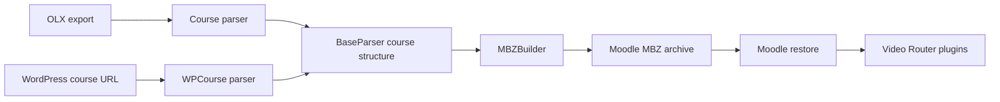

# Architecture

The converter uses one intermediate course structure for both input sources. This keeps Moodle MBZ generation
independent of the source format.

## Parser contract

`BaseParser` provides the shared structure used by `MBZBuilder`. Parsers populate chapters, subsections, page
components, static files, readings, and video metadata. `MBZBuilder` does not branch on whether the source was OLX
or WordPress.

## Source specific behaviour

The OLX parser reads local XML and static assets. The WordPress parser fetches public HTML pages and can download
linked PDFs. Both normalise their result into the same structure before conversion.

## Output

`MBZBuilder` creates a Moodle backup archive containing course XML, sections, activities, files, and plugin data.
The optional Video Router data lets Moodle resolve `[[vid:KEY]]` placeholders after restore.
