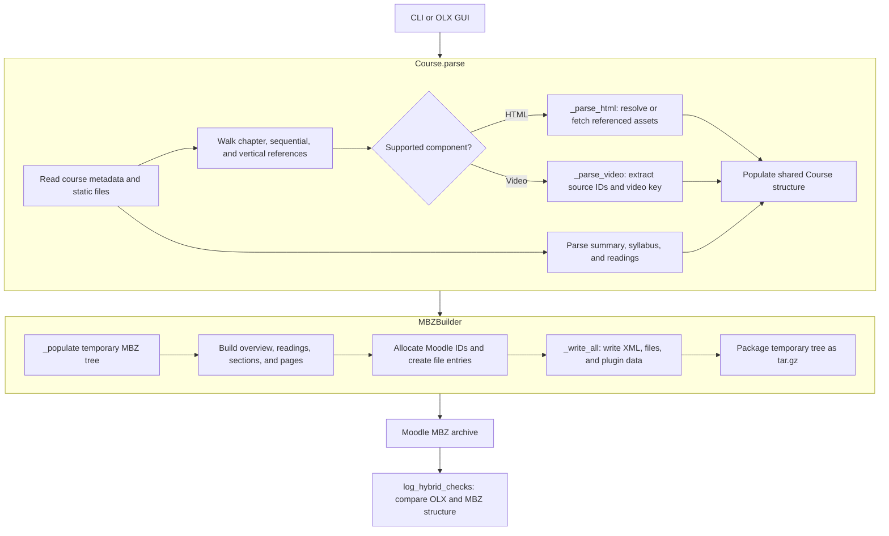

# OLX Importer

The OLX importer accepts an extracted course directory or a `.tar.gz` export through the `ocw` command and OLX GUI.

## Conversion data flow

The execution stages above correspond to the following Python entry points:

* [`ocw.cli.olx.main()`](../reference/python.md#ocw.cli.olx.main) and
  [`App._convert_one()`](../reference/python.md#ocw.gui.olx.App._convert_one): prepare a local OLX directory.
  Archives are extracted into a temporary directory. The CLI can also create a temporary asset-fetch directory.
* [`Course.parse()`](../reference/python.md#ocw.parser.Course.parse): follows OLX XML references, retains supported
  HTML and video components, gathers static files, and records summary, syllabus, readings, and video metadata.
* [`MBZBuilder.build()`](../reference/python.md#ocw.converter.builder.MBZBuilder.build): creates a temporary Moodle
  backup tree, assigns consistent Moodle IDs, writes XML and stored files, then packages the tree as a `.mbz` archive.
* [`log_hybrid_checks()`](../reference/python.md#ocw.hybrid_checks.log_hybrid_checks): reparses the OLX source and
  inspects the completed archive. It logs whether chapter, subsection, and page counts match.

## Structure mapping

OpenEdx chapters become Moodle sections. Sequentials become Moodle subsections when the sequential sections option
is enabled. Verticals become Moodle pages and preserve the order of supported components.

## Supported content

* Static HTML and source HTML fragments
* Images and locally exported static files
* PDFs and other referenced files
* Syllabus and readings content
* Video placeholders and Video Router source metadata

Unsupported interactive components are skipped while the surrounding page is retained.

## Warnings and checks

The parser warns about missing static files, content still hosted on edX infrastructure, unsupported components, and
ambiguous video pairing. The OLX CLI and GUI also run post-build chapter, subsection, and page parity checks.
